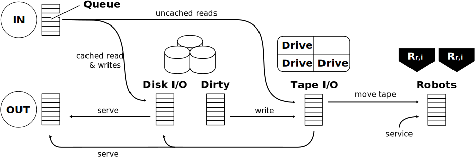

.. TapeSim documentation master file, created by
   sphinx-quickstart on Tue Oct 27 21:17:57 2015.
   You can adapt this file completely to your liking, but it should at least
   contain the root `toctree` directive.

Chained Request Queues
======================

To make the different resources in a tape system more
manageable is by keeping multiple request queues. Each request queue is allowed
to implement a prioritization schema as appears appropriate for the type of
resource.

    Different queues that are used to serve requests in the virtual tape system.

Incoming requests are analysed and distributed
depending on their type and if the requested files already resides on disk.
Writes and cached reads can be served immediately but uncached reads will
require to perform higher latency tape I/O. Items in a cache that are not made
coherent yet are commonly referred to as dirty. As dirty files accumulate, writing 
tape I/O has to be enqueued to keep the cache operational. The tape I/O queue
may prioritize reads and requests tapes to be served. An approach similar to 
this one is used by the simulation.

By default every queue processes incoming requests in
the order they arrive (FIFO). For tape systems this is somewhat unsatisfying
as it passes up a chance of optimization. Strictly applying FIFO may
disdain many of the benefits introduced through the use of caches. In
particular caches allow us to prioritize read requests when scheduling tape I/O
because by using sufficiently large caches we can delay writing on tape until
the system becomes idle.

.. contents::

API
====

.. autoclass:: tapesim.kernels.ChainedRequestQueues.Simulation
    :members:
    :inherited-members:

