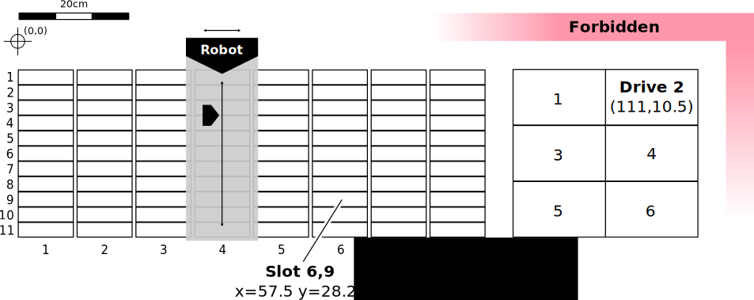

.. TapeSim documentation master file, created by
   sphinx-quickstart on Tue Oct 27 21:17:57 2015.
   You can adapt this file completely to your liking, but it should at least
   contain the root `toctree` directive.

StorageTek SL8500
=================

A common tape library system found in many large data centers is the the StorageTek SL8500.
Using a so called "centerline" layout for the drive bays the SL8500 has
a relatively exotic extension schema. Positioning the drives in the center is
advertised to guarantee short travel times for the robots averaging at below 11
seconds per robot, regardless of the size of the library complex. Each library
can be extended with up to 5 so called Storage Extension Modules (SEM) allowing
for up to 10.088 slots handled by up to 8 robots per library. Using
pass-through-ports, it is then possible to connect up to 32 libraries to form a
library complex containing over 320.000 cartridges and up to 2048 drives.

.. contents::

API
^^^

.. autoclass:: tapesim.components.StorageTekSL8500.StorageTekSL8500
    :members:
    :inherited-members:

Model Abstraction
^^^^^^^^^^^^^^^^^

    Different queues that are used to serve requests in the virtual tape system.

    SL8500 degrees of freedom.

References and Links
^^^^^^^^^^^^^^^^^^^^

SL8500 specific
"""""""""""""""

https://www.oracle.com/storage/tape-storage/sl8500-modular-library-system/index.html

https://docs.oracle.com/cd/E24306_05/SLEUG/toc.htm

http://docs.oracle.com/cd/E19912-01/CRCM2354/CRCM2354.pdf (2006)
http://docs.oracle.com/cd/E19912-01/96154KB/96154KB.pdf (2010)
https://docs.oracle.com/cd/E24306_05/SLEUG/E20869-11.pdf (2015)

Library Management
""""""""""""""""""

ACSLS
http://www.oracle.com/us/products/servers-storage/storage/tape-storage/034787.pdf (Datasheet for ACSLS)
https://docs.oracle.com/cd/E24306_05/SLEUG/E20869-11.pdf (ACSLS Manual)

HPSS
http://www.hpss-collaboration.org/
http://www.hpss-collaboration.org/online_doc.shtml

