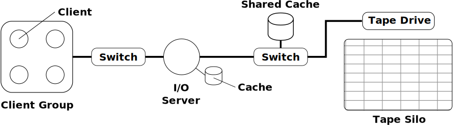

.. TapeSim documentation master file, created by
   sphinx-quickstart on Tue Oct 27 21:17:57 2015.
   You can adapt this file completely to your liking, but it should at least
   contain the root `toctree` directive.

How to Run Simulations
======================

The quickest way to get started is by turning to one of the preconfigured
simulations provided in in the examples directory. This document provides an
overview how to run or adapt a existing simulation for 

Contents:

.. toctree::
   :maxdepth: 2

Getting Started
---------------

In order to run a simulation usually three steps are necessary:

1. Configure a virtual storage systems and network.

2. Choose workloads that are used to stress the system.

3. Decide on information that should be collected during the simulation for reports.

Configuring a Virtual Storage System
~~~~~~~~~~~~~~~~~~~~~~~~~~~~~~~~~~~~

A stroage systems can be defined either at run time by adding components manually
or within a script or by preparing a XML file that houlds the vertices (components)
and edges (components connected via the network).

    A model for a minimal tape system featuring a storage silo and a disk based cache.
    Note also multiple possible clients and I/O servers for load balancing.

Common Components
-----------------

Generics
~~~~~~~~

.. autoclass:: tapesim.components.Drive.Drive
    :members:
    :inherited-members:

.. autoclass:: tapesim.components.IOServer.IOServer
    :members:
    :inherited-members:

Commercial
~~~~~~~~~~

.. autoclass:: tapesim.components.StorageTekSL8500.StorageTekSL8500

